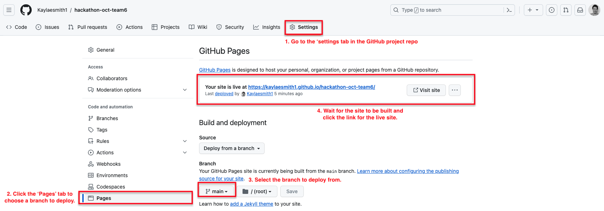
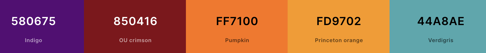
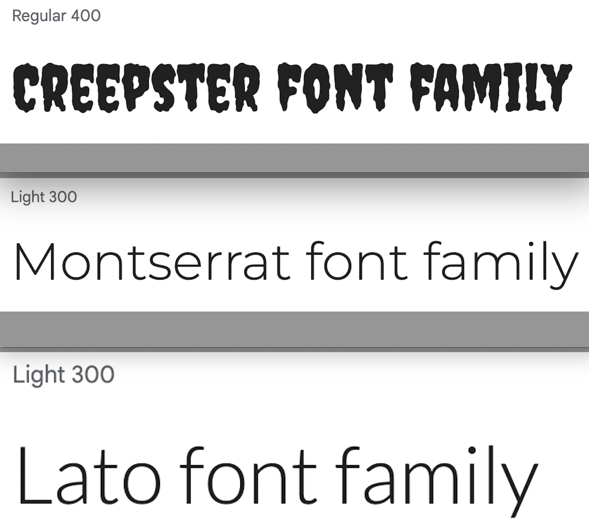

Access to [live page](https://kaylaesmith1.github.io/hackathon-oct-team6/index.html).

<h3>Phantom Forge Halloween Hackathon - Team: <i>Syntax Poltergeists</i>
</h3>

 
<h1 align="center"><strong>🎃🎃🎃 Phantom Forge: A Halloween Hackathon 🎃🎃🎃</strong>

</h1>

# SUBMISSION
## Deployment
#### _(please note, your team must also include the deployed links in the usual submission in Hackapp)_
This website was deployed to GitHub pages on the GitHub hosting platform following the steps below: 

  - From the project's GitHub repository, click the 'Settings' cog button.
  - From there, click the 'Pages' tab from the left side menu. 
  - Next under 'Source' select the main branch to deploy.
  - Refresh the page and a link to the live site will be provided, indicating successful deployment.

  
  
  The live site can be accessed [here](https://kaylaesmith1.github.io/hackathon-oct-team6/about.html).

## Criteria
Below please find brief documentation discussing how our team addressed the following criteria:

 ### 🎃 <strong>Creative design</strong>: 
  We chose a bright, interactive site design to entice users to browse and subsequently participate in the Halloween activities happening in their community. On each page, we incorporated a different transitional image above the title banner and other static images reflective of the Halloween atmosphere. 

  The About page presents information for the user regarding what they can find on our website, the age groups appropriate and a few past events to get them in the Halloween spirit. The Events page shows activities of various categories on a map of Ireland so people can easily view outings near them. Users, both individual and businesses, can contact the dev team by filling out a form on our Contact page. The last page of the navbar, the Gallery, displays various images of potential activities users can participate in. Clicking each image opens a zoom of the image with a brief description. Should a user navigate to a page that doesn't exist, a 404 page will appear with a link allowing them to return to the Home page.
  
  Finally, the footer has links to the Contact page and the Developers page where each participant in our team is mentioned with their respective photo, a description of their role on the team and their professional social media links (LinkedIn and GitHub). 

 ### 🎃 <strong>Fits Halloween theme</strong>:
  As a team we chose a color scheme, imagery, font styles and animations to closely fit the 'spooky', Halloween theme. Our colors are bright but also contrast well with each other on all pages. 
  
  The font styles were chosen based on clear readability while adhering to the Halloween theme. We decided on one main font to be used for titles, banners and larger text and two more 'typical' font styles for text in paragraphs and smaller styles. Further information on our design can be found in the Design section below.
 ### 🎃 <strong>Responsiveness</strong>: 
  Our website is fully responsive on all device sizes, adapting both text and images to various screen heights and widths. The website was tested and works well on Chrome, Safari (both from a laptop and iphone) and Firefox. Image clarity and text readability are maintained in all situations.

### 🎃 <strong>Planning using GitHub Projects</strong>: 
  Once the project repository was created by our team's scrum master, a link to GitHub Projects was set up to be able to follow the Agile framework. Each team member had a hand in creating tasks that needed to be done to bring our final project to fruition. Tasks were cited as: Must, Should, or Could have and bugs were identified and solved. Comments were written on each task when necessary to ensure smooth communication among all team members.

### 🎃 <strong>Realistic focus</strong>:
  The main goal for our project wanted to answer the question, <i>"What is there to do around me this Halloween?"</i> Through a bit of research for past real events, we created a website that includes many ideas for activities of all ages that users can take part in around the whole of Ireland. Our website gives users ideas, urges them to contact us with questions or if they want to host an event and displays images of activities that fit the Halloween theme. 

  Though it's important to note that this particular website was created for educational purproses and therefore does not reflect real, current events, it could very easily be adapted to fit that need. The map and pins are fully functional and filling out a contact form will send a user's query to the dev team. 

# ABOUT SUBMISSION
## Intro
Spook-tacular is a Halloween-themed website that helps users find fun activities happening near them (in Ireland) during the Halloween season. The Home page incorporates a greeting and carousel photo slideshow. The About page explains what the overall site does and what you can find while browsing. Clicking on the Events tab allows users to search for a wide range of Halloween-themed activities for participants of all age groups, with pinned locations on the map, by event category. By filling out a contact form on the Contact page, businesses are invited to start a partnership by advertising their wares, like Halloween-related products or events in the community neighbors can take part in. Individuals are also invited to contact us with questions or concerns. Finally, the Gallery page illustrates various Halloween activities, snacks and decor of the season. Clicking each image enlarges it and gives the image description.

The footer houses a Contact Us link that will take users to the individual contact form. The Developers link displays a page including all developers that worked on this project along with their respective role and professional social media links.

## Goal
The goal section provides a concise summary of the main objective or purpose of the project or software described in this README. It addresses the following aspects:

🎃 <strong>Problem Statement</strong>:
  The holiday season can be hectic and sometimes information on current events taking place in the community is hard to find. As such, the problem question our team chose to focus on for this Halloween-themed hackathon was, <i>"What activities are happening near me this Halloween?"</i>. 

🎃 <strong>Objective(s)</strong>: We wanted to create a fun, interactive, informational website answering the above question but opening up the answer to all age groups and all types of activies. As can be seen on our events page, we incorporate a range of activies users can participate in. Though, for the intents and purposes of this project the events aren't real, the information could easily be changed to reflect actual events in the community taking place during the Halloween season.

🎃 <strong>Target audience</strong>: Our target audience from a user standpoint could range from teens to adults, though there are activities the entire family could enjoy. The website is easy to navigate on all devices, following a clean layout with legible text.

🎃 <strong>Benefits</strong>: The main benefit of our website is having information about Halloween activities easily accessible. Teens, adults and families alike can enjoy these events in their community simply by consulting our website, which gives them a plethora of information that will help them decide if that event is suitable for them. 

## Design

The website was designed in a simple paragraph layout, which was intended to make it easier for the user to navigate. Each page contains a banner with a transition element, a custom logo, navigation bar and footer. 

### Color Scheme
The color scheme was chosen to reflect the 'Halloween' theme but maintain readability and high contrast.

The background of all site pages is the lightest orange color, reflecting the popular color of the Halloween season. This contrasts well with the brighter orange, used for some cards, the teal color used for the navbar, footer and some card backgrounds, and the dark purple and burgundy colors to accent important information.

All combinations of the colors used illustrate a contrast between background and text to ensure maximum user accessibility.

### Fonts
The group decided on three fonts to use for this project. 'Creepster' was used as the main font for titles and generally larger text as it, in our opinion, looked like it would fit well with the Halloween theme. 

The other two fonts, 'Montserrat' and 'Lato' were used to ensure text was easily readable and clearly visible to users.

## Technologies used
To complete our website, we incorporated HTML, CSS and Javascript, deploying the live website on GitHub Pages. Libraries used included JQuery and Bootstrap.

## Future implementations
At the outset the map on the Events page was sticky and as the user scrolled would show the list of event cards on the left-hand side of the page with the map on the right. It proved difficult to make completely responsive so we opted to keep it stagnant on larger screens and move it to show between the search bar and the first activity on smaller screens. In future implementations, it might be nice to have it remain visible while the user scrolls through the events so they can visualize where the event is exactly.

## Credits
In the credits section, we provide information about the sources used to complete our project. 

- [Coolors](https://coolors.co/) - Used to create color scheme.
- [Bootstrap](https://getbootstrap.com/docs/4.6/getting-started/introduction/): CSS used for developing responsiveness and styling the website.
- [JQuery](https://jquery.com): JQuery was used as one of the libraries to develop our website.
- [EmailJS](https://www.emailjs.com/): Used to link the contact form to developer's personal email account.
- [Figma](https://www.figma.com/) - Used to create wireframes for both desktop and mobile visuals.
- [Canva](https://canva.com/) - Canva AI image creator was used to create the images used for banners on each page.
- [PhotoPea](https://www.photopea.com/) - PhotoPea was used to edit images from Canva to be able to incorporate them throughout our website.
- [Jshint](https://jshint.com/) - Used to validate the JavaScript page.
- [Font Awesome](https://fontawesome.com/) - Used for icons on the home page and stars on the About page.
- [GitHub](https://github.com/) - Used for version control and agile methodology.
- [Google Fonts](https://fonts.google.com/) - Imported and used to change fonts on pages from default fonts.
- [W3C](https://www.w3.org/) - Used for HTML & CSS Validation.
- [Jshint](https://jshint.com/) - Used to validate the JavaScript page.

## Acknowledgements
Our team worked well together, we all helped each other on different aspects of the project. We divided the work in general, completing a page each to start but each team member was helpful to others if any of us ran into obstacles. Thanks, team!

Our CI mentor, Martin, was vigilant and offered help to our group when we needed clarification about origin pull requests. Thanks, Martin!

